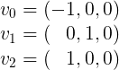
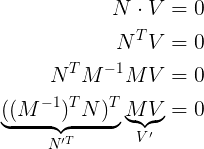
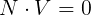
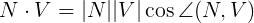
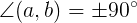
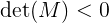
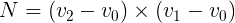
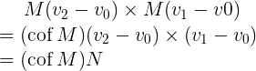
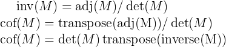

# The details of transforming normals

Have you ever seen `transpose(inverse(M)) * normal` in code before when transforming normals?

This is the defacto solution to dealing with non-uniform scale or skewed models when transforming normals and it's such an accepted practice that nearly every single graphics programming resource mentions and encourages it. The problem is it's _wrong_.

## How did we get here?
A geometric normal is fully defined by its orientation with respect to a surface and the fact that it's orthogonal / perpendicular to the tangent plane at the surface point.

When transforming a normal we want something that preserves both of those constraints. The inverse transpose matrix used to transform the normal is derived from satisfying just the latter. That is, the **dot product** should equal zero. What we should be using instead is the **cross product** as it enforces both.

Not easily persuaded? Take this very simple triangle



Now reflect it around the `zy` axis. You'll note that the normal does not reflect properly if `transpose(inverse(M))` is used to transform it. In fact, the normal points in the culled direction. Now all your lighting calculations end up as

```glsl
max(0, dot(n, l)) = 0
```

Lets take a look at the derivation with the **dot product** to see what is actually happening here



From the above we see that we need `transpose(inverse(M))`
In front of `N` in order to preserve orthogonality.


What is not so obvious here is that



Has more than one solution and orientation isn't considered. This is easy to show.



When the normal is not zero and the triangle isn't degenerate you get



Which means when you have `M` such that



Then you will get a normal that points in the completely opposite direction.

## Looking at it a bit differently

So what happens if we derive the normal from the **cross product** of three vertices instead?



Then we apply `M` to the vertices to get something more interesting



Where `cof` here is the [_cofactor_](https://en.wikipedia.org/wiki/Minor_(linear_algebra))

This tells us something rather interesting



The `transpose(inverse(M))` is missing the _sign_ from `det(M)` and that's why the normal is oriented the wrong way when `det(M) < 0`.

What we're actually interested in using is the cofactor instead of `transpose(inverse(M))`, which has the added benefit of being more efficent to compute and more accurate.

## Insight to be had
We should **not** be deriving the normal from the **dot product** because it leads to precisely this problem. Derive it from the **cross product** and teach the derivation of it using the **cross product**.

## Sample code
Included here is some sample C code for calculating the cofactor of a 4x4 matrix which can be used instead of `transpose(inverse(M))`

```c
float minor(const float m[16], int r0, int r1, int r2, int c0, int c1, int c2) {
  return m[4*r0+c0] * (m[4*r1+c1] * m[4*r2+c2] - m[4*r2+c1] * m[4*r1+c2]) -
         m[4*r0+c1] * (m[4*r1+c0] * m[4*r2+c2] - m[4*r2+c0] * m[4*r1+c2]) +
         m[4*r0+c2] * (m[4*r1+c0] * m[4*r2+c1] - m[4*r2+c0] * m[4*r1+c1]);
}

void cofactor(const float src[16], float dst[16]) {
  dst[ 0] =  minor(src, 1, 2, 3, 1, 2, 3);
  dst[ 1] = -minor(src, 1, 2, 3, 0, 2, 3);
  dst[ 2] =  minor(src, 1, 2, 3, 0, 1, 3);
  dst[ 3] = -minor(src, 1, 2, 3, 0, 1, 2);
  dst[ 4] = -minor(src, 0, 2, 3, 1, 2, 3);
  dst[ 5] =  minor(src, 0, 2, 3, 0, 2, 3);
  dst[ 6] = -minor(src, 0, 2, 3, 0, 1, 3);
  dst[ 7] =  minor(src, 0, 2, 3, 0, 1, 2);
  dst[ 8] =  minor(src, 0, 1, 3, 1, 2, 3);
  dst[ 9] = -minor(src, 0, 1, 3, 0, 2, 3);
  dst[10] =  minor(src, 0, 1, 3, 0, 1, 3);
  dst[11] = -minor(src, 0, 1, 3, 0, 1, 2);
  dst[12] = -minor(src, 0, 1, 2, 1, 2, 3);
  dst[13] =  minor(src, 0, 1, 2, 0, 2, 3);
  dst[14] = -minor(src, 0, 1, 2, 0, 1, 3);
  dst[15] =  minor(src, 0, 1, 2, 0, 1, 2);
}
```